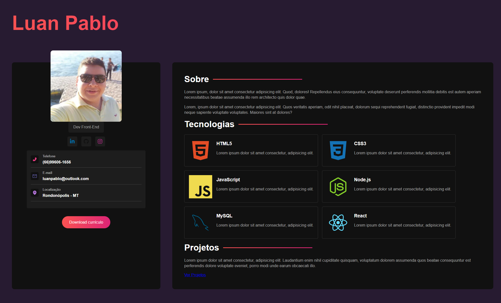

# Meu Portfólio

>Meu Portfólio usando Vite+React & SASS

Projeto construído seguindo as dicas do <b>Matheus Battisti - Hora de Codar</b> [YouTube](https://www.youtube.com/watch?v=5h4vMtBlQQU&t)

[Clique aqui para acessar o projeto](https://meu-portfolio-amber.vercel.app/)

## 🌐 Tecnologias 

  
 
 
 
 
 

## 📱 Contato

